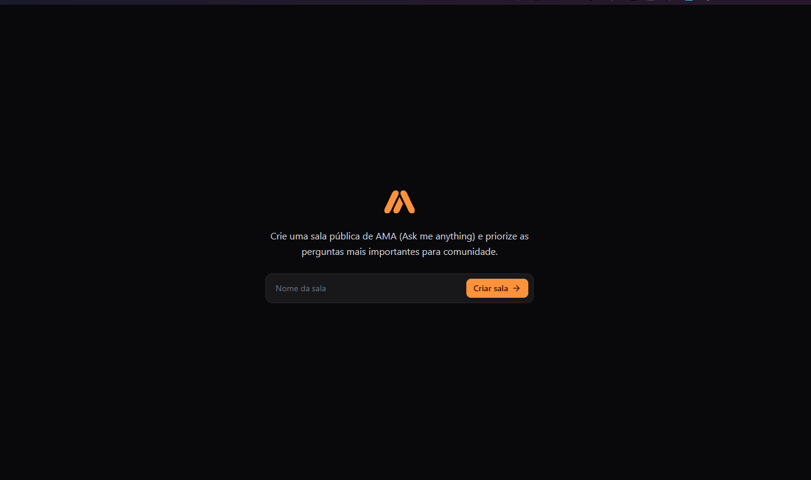
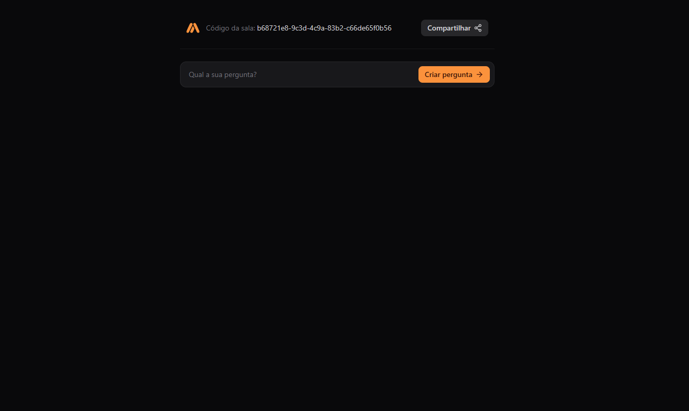
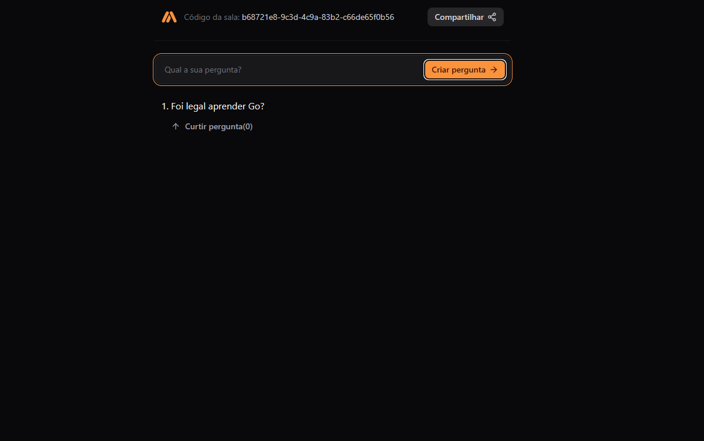
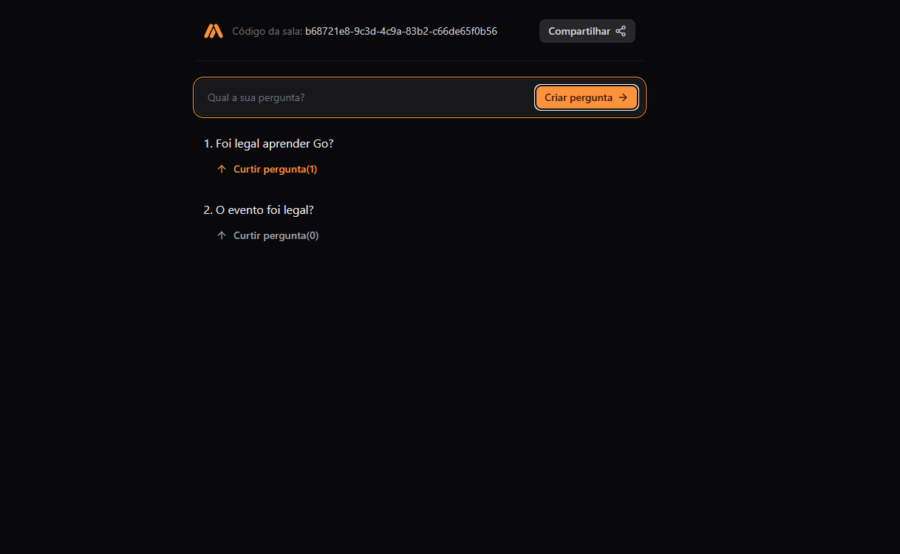

 
  <h1 align="center">Projects built during the Tech Go and React Week 2024. Made with 💜 at Rocketseat.</h1>
  
  
  
  

  

    🔗 <a href="https://github.com/Andreoew/semana-tech-go-react-server/tree/main/api">Link to backend</a> 🔗
     
     
    🔗 <a href="https://github.com/Andreoew/semana-tech-go-react-server/tree/main/web">Link to frontend</a> 🔗
  

  <!-- Write here what the project is about. -->
  <h1 align="center">About</h1>
  O projeto é um sistema backend para um aplicativo de bate-papo em tempo real. A API permite que os usuários criem salas de bate-papo, enviem mensagens e interajam com mensagens por meio de reações e atualizações de status. Os participantes podem se inscrever em salas de bate-papo específicas para receber atualizações em tempo real via WebSockets. O backend é desenvolvido usando Go e utiliza várias bibliotecas, como Chi para roteamento, Gorilla WebSocket para comunicação WebSocket e PGX para interações de banco de dados PostgreSQL. O frontend para o aplicativo é construído com React 19 e Vite.

🚧 Finished Project 🚧
[]

🚧 Under Construction 🚧
[✅]

